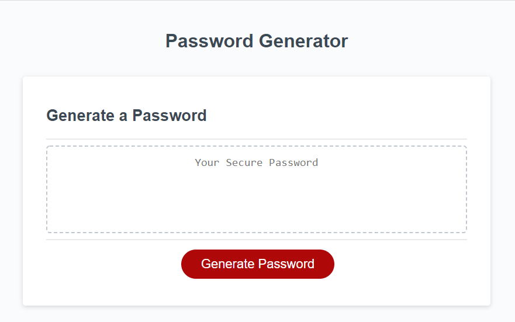
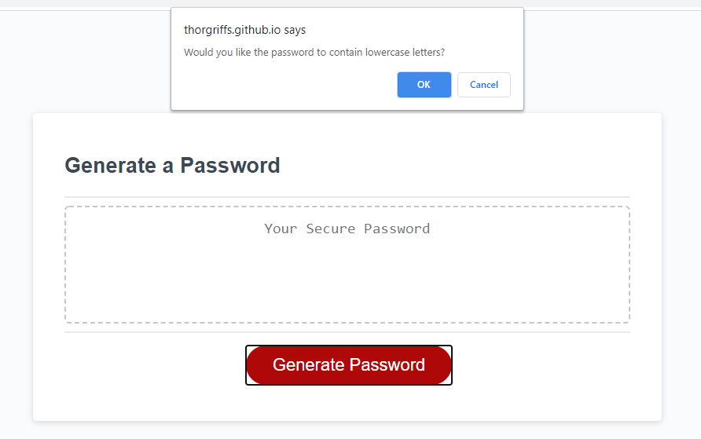
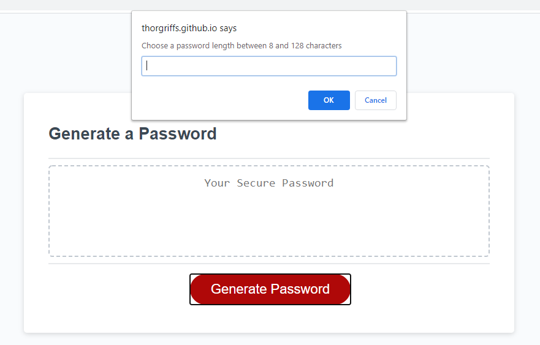
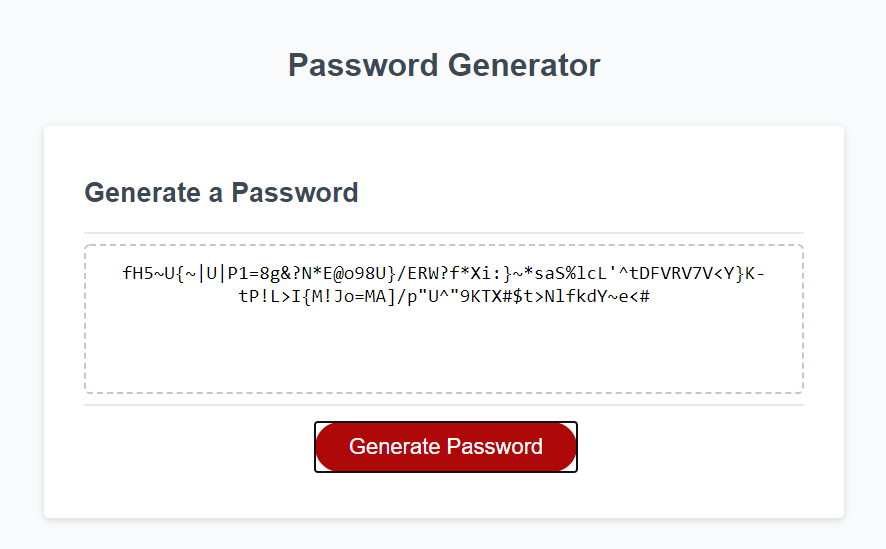

# Bootcamp Homework 03 - JavaScript: Password Generator

## My Password Generator

This is an assignment to create a password generator that allows the user to specify their preferred password criteria.  Starter code was provided that was then modified using JavaScript.  Requirements for the password generator include a clean and polished user interface, responsive design, and validation for selected password criteria.    

### Homework Deliverables and Codebase Updates

* Updated the provided `script.js` file
* Created a `passwordChar` object with array properties for each character type that could potentially populate the password (lowercase, uppercase, numbers, and special characters)
* Created a `random` function, defined by the `Math.floor` and `Math.random` functions, that can be called to generate random characters in the password
* Updated the `generatePassword` function with the following:
    * Defined `confirm` variables to prompt users to select character criteria to be used in the password
    * Defined a `prompt` variable to allow the user to define the password length
    * Created `if/else` statement for validation that acceptable criteria was chosen to generate the password with an alert to communicate to user when password selection criteria has not been met.  
    * Created new `password` and `selectedChars` arrays to hold the randomly selected characters of the password
    * Added conditional statements when a specific character type selection was confirmed by the user that:
        * Randomly selects a character from the character type selected and pushes it to the `password` array
        * Uses the `concat()` method to merge the `selectedChars` and confirmed character arrays
    * Added a while statement that loops over the `selectedChars` array to populate the `password` array with randomly selected characters until the password length requirement has been satisfied
    * Used the `join()` method to convert the `password` array to a string that can be passed to the `writePassword()` function
* Created a README.md file to describe and demo the code
* Deployed the application to a live URL

### Notes on this project

* I struggled very much in the class activities for the JavaScript lectures.  The time crunch creates a scenario where I am uncertain about how to proceed, or even just begin.  However this project reassured for me that, with some extra time and the ability to iterate through the code, I am able to produce a functional password generator that utilizes javascript objects and functions.  It showed me that I have learned and retained some javascript information.
* In iterating through the code, I created some `console.log` statements to help me understand the results.  I was unsure if I should remove these, but left them in as artifacts of my process during this assignment.  
* I am uncertain about my choice to leave the password criteria selectors as default browser confirms and prompts, both of which are not meeting the responsive design criteria
* After realizing that I was repeating the same `if` statements inside the `generatePassword` function I considered condensing them all into their own function.  I ultimately left the code as is due to time constraints. 

## Screenshot

The following images show the password generator appearance and functionality:

## Application URL
* [Password Generator](https://thorgriffs.github.io/pw-gen/)